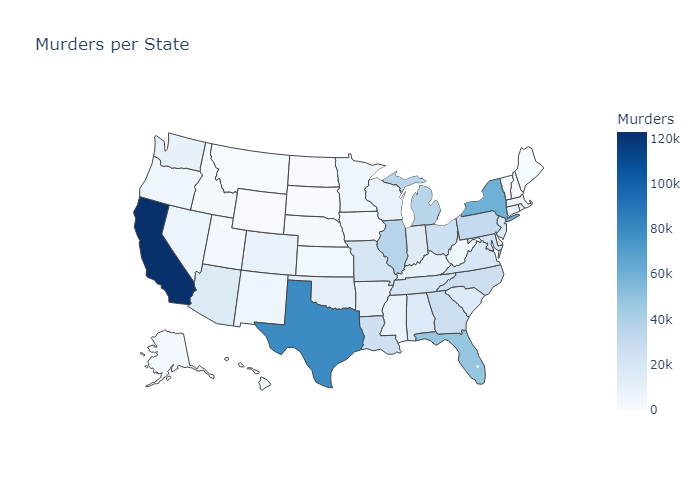
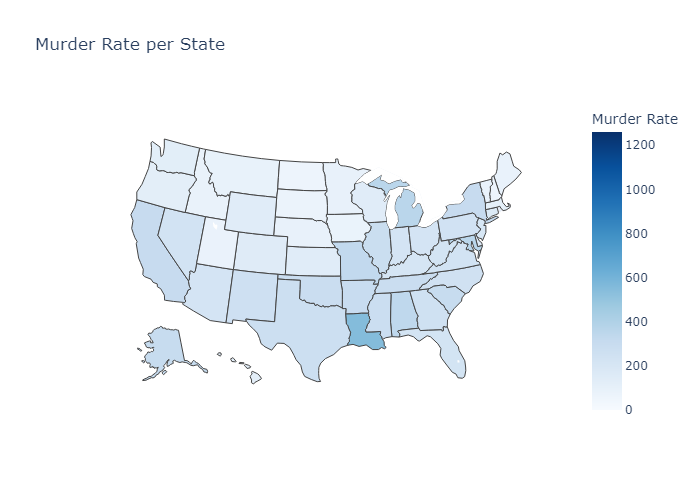

# Umorov in napadov v ZDA
## Člani skupine

| Ime in priimek | Vpisna številka |
| -------------- | --------------- |
| Bodan Temelkovski | 63210463 |
| Anastasija Djajkovska | 63210409 |
| Bojan Spasovski | 63210453 |
| Dimitar Nakov  | 63210442 |
| Danilo Djuric | 63210410 |

## Podatke
Mi bomo uporabljali podatke o umorih v ZDA, populaciji v ZDA in posedovanju orožja v ZDA. Vse te podatki so že podani na “Kaggle” in “World population overview”.
- USA Homicides 1976-2020: https://www.kaggle.com/datasets/stephanieblack1990/usa-homicides-19762020?select=SHR76_20StephanieBlack.xlsx
- Guns per Capita 2023: https://worldpopulationreview.com/state-rankings/guns-per-capita
- 2019 Census US Population Data By State: https://www.kaggle.com/datasets/peretzcohen/2019-census-us-population-data-by-state

## Opis podatkov in atribute

**USA Homicides 1976-2020:**
- Država v ZDA, mesto, datum
- Policijsa agencija, ki je bila odgovorna
- Ali je bil umor razrešen
- Pol, rasa in starost udeležnicev umora
- Način umora, orožje in okoliščine umora
- Sorodnost med morilcem in žrtvijo

**Guns per Capita 2023**
- Država v ZDA
- Podatke o številu prebivalcev te države
- Število registriranih orožij

## Cilj
Naš cilj je natančneje raziskati umore v ZDA, ter raziskati okoliščine in zunanje dejavnike, ki vodijo do umorov in ali obstajajo povezave z načinom njihovega izvajanja.

Vprašanja, ki jih bomo obdelovali:
- Katera zvezna država ZDA ima največ umorov v splošnem?
- Ali odstotek posedovanja orožja posamezne zvezne države vpliva na število umorov v tej zvezni državi?
- Analiza karakteristik morilca in žrtev.
- Katera okolščina največ pripelje do umorov in kakšno srodstvo sta imela morilec in žrtev?
- Analiza razrešitev umora in ali tip agencije vpliva na razrešitvi umora?

##Žačeli bomo z analizo umorov v posamezni zvezni državi
```python
murders_by_state = df_homicides.groupby("State")["ID"].count().reset_index()
murders_by_state.columns = ["State", "Murders"]

state_abbr = {
    'Alabama': 'AL', 'Alaska': 'AK', 'Arizona': 'AZ','Arkansas': 'AR','California': 'CA','Colorado': 'CO','Connecticut': 'CT','Delaware': 'DE','Florida': 'FL','Georgia': 'GA','Hawaii': 'HI','Idaho': 'ID', 'Illinois': 'IL','Indiana': 'IN','Iowa': 'IA','Kansas': 'KS','Kentucky': 'KY','Louisiana': 'LA','Maine': 'ME','Maryland': 'MD','Massachusetts': 'MA','Michigan': 'MI','Minnesota': 'MN','Mississippi': 'MS','Missouri': 'MO','Montana': 'MT','Nebraska': 'NE','Nevada': 'NV','New Hampshire': 'NH','New Jersey': 'NJ','New Mexico': 'NM','New York': 'NY','North Carolina': 'NC','North Dakota': 'ND','Ohio': 'OH','Oklahoma': 'OK','Oregon': 'OR','Pennsylvania': 'PA','Rhodes Island': 'RI','South Carolina': 'SC','South Dakota': 'SD','Tennessee': 'TN','Texas': 'TX','Utah': 'UT','Vermont': 'VT','Virginia': 'VA','Washington': 'WA','West Virginia': 'WV','Wisconsin': 'WI', 'Wyoming': 'WY', 'District of Columbia': 'DC'
}

murders_by_state['State'] = murders_by_state['State'].replace(state_abbr)

fig = px.choropleth(murders_by_state, 
                    locations='State', 
                    locationmode="USA-states", 
                    color='Murders',
                    scope="usa",
                    color_continuous_scale='Blues',
                    range_color=(0, murders_by_state['Murders'].max()),
                    title='Murders per State')
```

<br />
Iz slike je očitno da največ umorov so v Kaliforniji, vnedar če hočemo biti bolj natančne moramo preračunati število umorov na 100.000 prebivalcev.
```python
murders_by_state = df_homicides.groupby("State")["ID"].count().reset_index()
murders_by_state.columns = ["State", "Murders"]

merged_df = pd.merge(murders_by_state, df_population, on='State')
merged_df['Murder Rate'] = merged_df['Murders'] / merged_df['Population'] * 100000

state_abbr = {
    'Alabama': 'AL', 'Alaska': 'AK', 'Arizona': 'AZ','Arkansas': 'AR','California': 'CA','Colorado': 'CO','Connecticut': 'CT','Delaware': 'DE','Florida': 'FL','Georgia': 'GA','Hawaii': 'HI','Idaho': 'ID', 'Illinois': 'IL','Indiana': 'IN','Iowa': 'IA','Kansas': 'KS','Kentucky': 'KY','Louisiana': 'LA','Maine': 'ME','Maryland': 'MD','Massachusetts': 'MA','Michigan': 'MI','Minnesota': 'MN','Mississippi': 'MS','Missouri': 'MO','Montana': 'MT','Nebraska': 'NE','Nevada': 'NV','New Hampshire': 'NH','New Jersey': 'NJ','New Mexico': 'NM','New York': 'NY','North Carolina': 'NC','North Dakota': 'ND','Ohio': 'OH','Oklahoma': 'OK','Oregon': 'OR','Pennsylvania': 'PA','Rhodes Island': 'RI','South Carolina': 'SC','South Dakota': 'SD','Tennessee': 'TN','Texas': 'TX','Utah': 'UT','Vermont': 'VT','Virginia': 'VA','Washington': 'WA','West Virginia': 'WV','Wisconsin': 'WI', 'Wyoming': 'WY', 'District of Columbia': 'DC'
}

merged_df['State'] = merged_df['State'].replace(state_abbr)

fig = px.choropleth(merged_df, 
                    locations='State', 
                    locationmode="USA-states", 
                    color='Murder Rate',
                    scope="usa",
                    color_continuous_scale='Blues',
                    range_color=(0, merged_df['Murder Rate'].max()),
                    title='Murder Rate per State')
```

<br />
Ker iz slike ne moremo ugotoviti katera država ima največ umorov, smo morali pogledati še en graf in smo ugotovili da ta država je "District of Columbia".

##Ali lastništvo orožja vpliva na stopnjo umorov v posameznih državah?
Najprej smo izračunali, katero orožje se najpogosteje uporablja pri umorih. Iz teh analiz, firearms so bili najštevilčnejši. Zato smo hoteli preveriti ali obstaja korelacija med število lastništva orožja in število umorov v posamezni državi. 
```python
df_guns_sorted = df_guns.sort_values(by="pop2023", ascending=False)
df_guns_sorted["gun_ownership"] = df_guns_sorted["gunsRegistered"] / df_guns_sorted["pop2023"] * 100
guns_precentage = df_guns_sorted.sort_values(by="gun_ownership", ascending=False).head(50)
guns_per_state = df_guns.groupby("state")["gunsRegistered"].sum().sort_values(ascending=False)
```

<br />
```python
homocides_per_capita = (df_homicides.groupby("State")["ID"].count() / df_guns.set_index("state")["pop2023"]) * 100000
homocides_per_capita = homocides_per_capita.sort_values(ascending=False).head(50)
common_states = set(guns_precentage["state"]).intersection(set(homocides_per_capita.index))
gun_ownership_per_capita = guns_precentage[guns_precentage["state"].isin(common_states)]['gun_ownership']
homicides_per_capita = homocides_per_capita[homocides_per_capita.index.isin(common_states)]
gun_ownership_per_capita = np.array(gun_ownership_per_capita)
homicides_per_capita = np.array(homicides_per_capita)
correlation_coefficient = np.corrcoef(gun_ownership_per_capita, homicides_per_capita)[0, 1]
print(correlation_coefficient)
``` 
Potem smo izračunali še korelacijski koeficient in smo dobili **0.7109630367945233**, kar pomeni, da obstaja precej visoka korelacija med tema dvema.

##Analiza karakteristik morilca in žrtev

<br />
Iz analize lahko vidimo, da je večina morilcev moških in zelo majhen odstotek žensk. Kar zadeva starostni razpon, vidimo, da je večina morilcev starih od 20 do 30 let in je majhen odstotek otrok med morilci od 0 do 10 let. Končno, rasa večine morilcev je tipično belci, ki jim tesno sledijo Afroameričani in velik upad Azijcev in drugih.

<br />
Iz analize podatkov o žrtvah lahko vidimo, da je tako kot morilcev veliko število žrtev moških, medtem ko je žrtev žensk manj, a še vedno veliko. Kar zadeva starost žrtev, je najpogosteje od 20 do 30 let, medtem ko je zelo žalostna statistika število žrtev od 0 do 10 in 10 do 20 let. In končno, rasa žrtev je najpogosteje belci, zelo blizu pa jim sledijo Afroameričani.

##Katera okolščina največ pripelje do umorov in kakšno srodstvo sta imela morilec in žrtev?
```python
circumstance_relationship_count = df_homicides.groupby(['Circumstance', 'Relationship'])['Relationship'].count().unstack()
circumstance_relationship_count['Family_member'] = circumstance_relationship_count[['Brother', 'Sister','Common-law husband','Common-law wife', 'Daughter', 'Other family','Son', 'Stepdaughter','Stepfather','Stepmother','Stepson','Wife']].sum(axis=1)
circumstance_relationship_count['Acquaintance'] = circumstance_relationship_count[['Acquaintance', 'Employee', 'Employer']].sum(axis=1)
circumstance_relationship_count['Ex-spouse'] = circumstance_relationship_count[['Ex-wife', 'Ex-husband']].sum(axis=1)
circumstance_relationship_count['Partner'] = circumstance_relationship_count[['Boyfriend', 'Girlfriend', 'Homosexual relationship']].sum(axis=1)

labels = circumstance_relationship_count.index
x = np.arange(len(labels))
width = 0.25

fig, (ax1, ax2) = plt.subplots(ncols=2, figsize=(14, 9))
fig.subplots_adjust(wspace=0.4)
```


